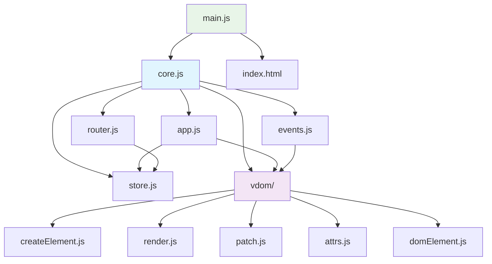

# PicoJS Framework

<div align="center">
  
  <h3>A lightweight, zero-dependency JavaScript framework for building reactive web applications</h3>
</div>

<p align="center">
  <a href="https://github.com/yourusername/picojs-framework"></a>
  <a href="https://yourusername.github.io/picojs-framework"></a>
  <a href="https://opensource.org/licenses/MIT"></a>
</p>

<p align="center">
  
  
  
  
  
</p>

---

A lightweight, zero-dependency JavaScript framework for building reactive web applications with modern architecture patterns.

## 📋 Table of Contents

- [Overview](#-overview)
- [Features](#-features)
- [Tech Stack](#-tech-stack)
- [Architecture](#-architecture)
- [Framework Structure](#-framework-structure)
- [Getting Started](#-getting-started)
- [API Documentation](#-api-documentation)
- [Code Examples](#-code-examples)
- [TodoMVC Demo](#-todomvc-demo)
- [Why It Works This Way](#-why-it-works-this-way)
- [Contributing](#-contributing)
- [License](#-license)

## 🎯 Overview

**PicoJS Framework** is a minimal yet powerful JavaScript framework designed for building reactive web applications. It combines the best ideas from modern frameworks like React and Vue but strips away complexity to focus on core concepts. With zero external dependencies, it provides Virtual DOM rendering, reactive state management, event delegation, and hash-based routing - all in under 10KB gzipped.

The framework emphasizes simplicity and learnability, making it perfect for developers who want to understand how modern web frameworks work under the hood. Whether you're building a small project or learning framework internals, PicoJS gives you the tools you need without the overhead.

## ✨ Features

### Core Functionality
- **Virtual DOM** - Efficient rendering with minimal DOM updates
- **Reactive State** - Automatic UI updates when state changes
- **Component Architecture** - Build UIs with composable functions
- **Event System** - Declarative event handling with automatic cleanup
- **Router** - Hash-based navigation that syncs with application state

### Developer Experience
- **Zero Dependencies** - No external libraries required
- **Small Bundle Size** - Under 10KB gzipped for fast loading
- **ES6 Modules** - Modern JavaScript with tree-shaking support
- **Educational** - Clean code that's easy to understand and modify
- **Browser Native** - Works in all modern browsers without transpilation

### Performance
- **Efficient Diffing** - Only updates changed DOM elements
- **Event Delegation** - Single listeners for better performance
- **Memory Efficient** - Automatic cleanup prevents memory leaks
- **Fast Rendering** - Optimized Virtual DOM patching algorithm

## 🛠 Tech Stack

### Core Technologies
- **JavaScript ES6+** - Modern JavaScript with modules
- **Virtual DOM** - Custom implementation for efficient rendering
- **Hash Routing** - Client-side routing without server configuration
- **Event Delegation** - Optimized event handling system

### Browser Support
- Chrome 60+
- Firefox 55+
- Safari 11+
- Edge 79+

### Development Tools
- **Local Server** - Python's built-in server for development
- **ES6 Modules** - Native browser module support
- **Git** - Version control and collaboration

## 🏗 Architecture

PicoJS follows a modular architecture where each piece has a single responsibility. The framework is built around three main concepts:

1. **State Management** - A reactive store that triggers re-renders
2. **Virtual DOM** - A lightweight representation of the real DOM
3. **Event System** - Declarative event handling with delegation

### Data Flow

```
User Interaction → Event Handler → State Update → View Function → Virtual DOM → DOM Patch → UI Update
```

This unidirectional data flow makes applications predictable and easy to debug.

## 📁 Framework Structure

The framework is organized into focused modules, each handling a specific concern:

```
picojs-framework/
├── framework/
│   ├── core.js              # Main exports and framework initialization
│   ├── app.js               # Application lifecycle management
│   ├── store.js             # Reactive state management
│   ├── router.js            # Hash-based routing system
│   ├── events.js            # Event delegation and handling
│   └── vdom/                # Virtual DOM implementation
│       ├── createElement.js # Virtual node creation utilities
│       ├── render.js        # Main rendering pipeline
│       ├── patch.js         # DOM diffing and patching
│       ├── attrs.js         # Attribute management
│       └── domElement.js    # DOM element creation
├── app/                     # Application code
│   ├── main.js             # Main application entry point
│   └── styles.css          # Application styles
├── index.html              # Main HTML page
├── createApp.sh            # Project scaffolding script
└── README.md               # This documentation
```

### Module Relationships



**Core Module (core.js)** - The main entry point that exports all framework functionality
**App Module (app.js)** - Handles application initialization and the main render loop
**Store Module (store.js)** - Manages reactive state with subscription system
**Router Module (router.js)** - Provides hash-based navigation
**Events Module (events.js)** - Implements event delegation for performance
**VDOM Modules** - Handle virtual DOM creation, diffing, and patching

## 🚀 Getting Started

### Quick Start (Recommended)

The fastest way to get started is using the included setup script:

```bash
# Clone or download the framework
git clone https://github.com/yourusername/picojs-framework.git
cd picojs-framework

# Create a new project
./createApp.sh my-awesome-app

# Move into your new project
cd my-awesome-app

# Start development server
python3 -m http.server 8000

# Open in browser
open http://localhost:8000
```

The script creates a complete project with:
- All framework files copied
- A starter application with counter example
- Proper directory structure
- Ready-to-run HTML file

### Manual Setup

If you prefer to set up manually:

1. **Create your HTML file:**
```html
<!DOCTYPE html>
<html lang="en">
<head>
    <meta charset="UTF-8">
    <meta name="viewport" content="width=device-width, initial-scale=1.0">
    <title>My PicoJS App</title>
    <link rel="stylesheet" href="/app/styles.css">
</head>
<body>
    <div id="root"></div>
    <script src="/app/main.js" type="module"></script>
</body>
</html>
```

2. **Create your main JavaScript file (`/app/main.js`):**
```javascript
import { createApp, createElement as h } from '../framework/core.js';

// Your app code here
const initialState = { count: 0 };

function view(state) {
    return h('div', {},
        h('h1', {}, `Count: ${state.count}`),
        h('button', {
            onclick: () => store.setState({ count: state.count + 1 })
        }, 'Increment')
    );
}

const store = createApp({
    view,
    initialState,
    rootElement: document.getElementById('root')
});
```

3. **Start a local server:**
```bash
python3 -m http.server 8000
```

## 📚 API Documentation

### createElement (alias: h)

Creates a virtual DOM element. This is the foundation of building UIs in PicoJS.

**Parameters:**
- `tag` (string) - HTML tag name ('div', 'span', 'button', etc.)
- `attrs` (object) - Attributes and event handlers
- `children` (...any) - Child elements or text content

**Returns:** Virtual node object

**Examples:**
```javascript
import { createElement as h } from './framework/core.js';

// Simple text element
const title = h('h1', {}, 'Hello World');

// Element with attributes
const input = h('input', {
    type: 'text',
    placeholder: 'Enter your name',
    value: 'John Doe'
});

// Nested elements
const card = h('div', { class: 'card' },
    h('h2', {}, 'Card Title'),
    h('p', {}, 'Card content here...')
);
```

### createApp

Initializes your PicoJS application with state management and rendering.

**Parameters:**
- `options.view` (function) - Function that returns virtual DOM based on state
- `options.initialState` (object) - Starting state for your application
- `options.rootElement` (HTMLElement) - DOM element to render into

**Returns:** Store object with state management methods

**Example:**
```javascript
import { createApp, createElement as h } from './framework/core.js';

const initialState = {
    todos: [],
    filter: 'all'
};

function view(state) {
    return h('div', {},
        // Your UI components here
    );
}

const store = createApp({
    view,
    initialState,
    rootElement: document.getElementById('root')
});
```

### createStore

Creates a reactive state store. Usually used internally by `createApp`.

**Methods:**
- `getState()` - Returns current state
- `setState(newState)` - Updates state and triggers re-render
- `subscribe(listener)` - Adds function to call on state changes

**Example:**
```javascript
import { createStore } from './framework/core.js';

const store = createStore({ count: 0 });

store.subscribe(() => {
    console.log('State updated:', store.getState());
});

store.setState({ count: 1 }); // Triggers subscription
```

### createRouter

Adds hash-based routing that syncs with your application state.

**Parameters:**
- `store` (object) - Your app's store from `createApp`

**Example:**
```javascript
import { createApp, createElement as h } from './framework/core.js';
import { createRouter } from './framework/router.js';

const initialState = { route: '#/' };

function view(state) {
    return h('div', {},
        h('nav', {},
            h('a', { href: '#/home' }, 'Home'),
            h('a', { href: '#/about' }, 'About')
        ),
        h('p', {}, `Current route: ${state.route}`)
    );
}

const store = createApp({ view, initialState, rootElement: document.getElementById('root') });
createRouter(store); // Now URL changes update state.route
```

## 💡 Code Examples

### Basic Counter App

```javascript
import { createApp, createElement as h } from '../framework/core.js';

const initialState = { count: 0 };

function view(state) {
    return h('div', { class: 'counter' },
        h('h1', {}, `Count: ${state.count}`),
        h('button', {
            onclick: () => store.setState({ count: state.count + 1 })
        }, '+'),
        h('button', {
            onclick: () => store.setState({ count: state.count - 1 })
        }, '-')
    );
}

const store = createApp({
    view,
    initialState,
    rootElement: document.getElementById('root')
});
```

### Todo List Application

```javascript
import { createApp, createElement as h } from '../framework/core.js';

const initialState = {
    todos: [],
    inputValue: ''
};

function view(state) {
    return h('div', { class: 'todo-app' },
        h('h1', {}, 'Todo List'),
        h('input', {
            type: 'text',
            value: state.inputValue,
            placeholder: 'Add a new todo...',
            oninput: (e) => store.setState({ inputValue: e.target.value })
        }),
        h('button', {
            onclick: () => {
                if (state.inputValue.trim()) {
                    store.setState({
                        todos: [...state.todos, {
                            id: Date.now(),
                            text: state.inputValue,
                            completed: false
                        }],
                        inputValue: ''
                    });
                }
            }
        }, 'Add Todo'),
        h('ul', {},
            ...state.todos.map(todo =>
                h('li', {
                    class: todo.completed ? 'completed' : '',
                    onclick: () => {
                        const updatedTodos = state.todos.map(t =>
                            t.id === todo.id ? { ...t, completed: !t.completed } : t
                        );
                        store.setState({ todos: updatedTodos });
                    }
                }, todo.text)
            )
        )
    );
}

const store = createApp({
    view,
    initialState,
    rootElement: document.getElementById('root')
});
```

### Simple Router Example

```javascript
import { createApp, createElement as h } from '../framework/core.js';
import { createRouter } from '../framework/router.js';

const initialState = { route: '#/' };

function view(state) {
    const routes = {
        '#/': h('div', {}, h('h1', {}, 'Home Page'), h('p', {}, 'Welcome!')),
        '#/about': h('div', {}, h('h1', {}, 'About'), h('p', {}, 'About this app...')),
        '#/contact': h('div', {}, h('h1', {}, 'Contact'), h('p', {}, 'Get in touch!'))
    };

    return h('div', {},
        h('nav', {},
            h('a', { href: '#/home' }, 'Home'),
            h('a', { href: '#/about' }, 'About'),
            h('a', { href: '#/contact' }, 'Contact')
        ),
        routes[state.route] || h('div', {}, h('h1', {}, '404 - Page Not Found'))
    );
}

const store = createApp({ view, initialState, rootElement: document.getElementById('root') });
createRouter(store);
```

## 🎨 TodoMVC Demo

The framework includes a complete TodoMVC implementation that demonstrates all features in action. This is the classic TodoMVC example that developers use to compare framework capabilities.

**Features demonstrated:**
- Adding, editing, and deleting todos
- Marking todos as complete/incomplete
- Filtering todos (All, Active, Completed)
- Bulk actions (toggle all, clear completed)
- Local storage persistence
- Responsive design

**To run the demo:**
1. Open `index.html` in your browser
2. Start adding todos and explore the features
3. Check the browser's developer tools to see the Virtual DOM in action

The TodoMVC code serves as an excellent reference for building real applications with PicoJS.

## 🤔 Why It Works This Way

### Virtual DOM Approach

Instead of directly manipulating the DOM (which can be slow and error-prone), PicoJS uses a Virtual DOM:

1. **Describe your UI** as a function of state
2. **Generate virtual elements** (plain JavaScript objects)
3. **Compare** old vs new virtual trees
4. **Update only what changed** in the real DOM

This approach gives you:
- **Performance** - Minimal DOM operations
- **Predictability** - UI is always in sync with state
- **Simplicity** - No manual DOM manipulation

### Reactive State Management

State changes automatically trigger UI updates through a subscription system:

```javascript
// When you call setState
store.setState({ count: 1 });

// The framework automatically:
// 1. Updates internal state
// 2. Calls your view function with new state
// 3. Generates new virtual DOM
// 4. Patches the real DOM
// 5. UI updates instantly
```

### Event Delegation System

Instead of attaching event listeners to every element, PicoJS uses event delegation:

- **Single listener** per event type on the root element
- **Event bubbling** carries events up to the root
- **Data attributes** identify which element was clicked
- **Automatic cleanup** when elements are removed

This provides better performance and prevents memory leaks.

### Hash-Based Routing

Hash routing (`#/page`) works without server configuration:

- **No page reloads** - Changes happen instantly
- **Bookmarkable** - URLs work with browser back/forward
- **Simple** - No complex server setup needed
- **State synced** - URL changes update your app state

## 🌐 Live Demo

Check out the live demo deployed on GitHub Pages:  
**[https://sahmedhusain.github.io/picojs-framework](https://yourusername.github.io/picojs-framework)**

The demo includes the full TodoMVC application running directly in the browser.

## 🤝 Contributing

We welcome contributions! Here's how you can help:

1. **Fork the repository**
2. **Create a feature branch** (`git checkout -b feature/amazing-feature`)
3. **Make your changes**
4. **Test thoroughly** - Make sure existing functionality still works
5. **Commit your changes** (`git commit -m 'Add amazing feature'`)
6. **Push to the branch** (`git push origin feature/amazing-feature`)
7. **Open a Pull Request**

### Development Guidelines

- Keep the bundle size small
- Maintain zero dependencies
- Write clear, commented code
- Add examples for new features
- Test in multiple browsers

## 📄 License

This project is licensed under the MIT License - see the [LICENSE.md](LICENSE.md) file for details.

## 👨‍💻 Author

**Sayed Ahmed Husain**  
Email: [sayedahmed97.sad@gmail.com](mailto:sayedahmed97.sad@gmail.com)

---

**Built with ❤️ for simplicity**
